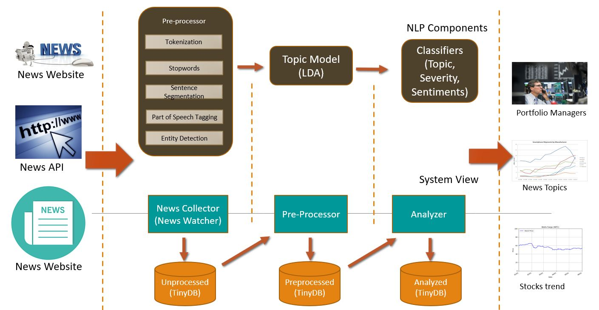

## Team Details

Team members:
1)	Amit Agrawal (amita3@illinois.edu)
2)	Noushad Kunju-Muhammed (noushad2@illinois.edu)
3)	Mani Bayani(mbayani2@illinois.edu) - Group Leader

# Disruptive News Detector

Disruptive/Negative news coverage, such as poor earnings reports or stories of bad corporate governance, normally decreases demand, meaning more people want to sell the stock, thereby lowering the market price. Demand can also be negatively affected by news stories covering economic and political uncertainty, or unexpected, negative events.

In this project, we built a software to detect company-specific disruptive news and continuity of news from news articles in real-time and present the right discontinuity and severity information to the user. The software processes the news articles and predicts whether it is disruptive for the company, which is mentioned in the news article or not. It then further fetches the stock price of the company in real-time and try to show the coorelation between the negative news and stock price fluctuations. 

There are 2 modes to run it (driven by settings)- 1) Batch Mode and 2) Continuous Monitoring

1) **Batch Mode** - In this mode, some news are already copied in the input folder. Program process each news one-by-one and determines if news is negative for a company or not and what is the severity level. It shows the news severity on graph. Along with it, it pulls the stock price of that company during that time period. Trying to show the coorelation between news and its stock price.

2) **Continuous Monitoring** - We can run the program to process live news feed. Program will monitor for any new news dropped in an input folder. As soon as news is dropped in a folder, it will be processed, stock process are pulled to show the effect of news.

It will display 2 graphs - 
1) Graph that shows severity of the disruptive news 
2) Stock price of the company during that time period


## Getting Started

These instructions will get you a copy of the project up and running on your local machine for development and testing purposes. 


### Prerequisites
Before running this project, please make sure you have all the required python modules installed.
The software is using below python modules.
* gensim
* matplotlib
* nltk
* numpy
* pandas
* pandas_datareader
* scikit_learn
* spacy
* watchdog
* tinydb
* toml

The prerequisites are defined with respect to **Python 3**. To install python libraries, run below command:
(make sure 'requirements.txt' file is available where you are running it )

```bash
pip3 install -r requirements.txt
```

If you get permission error while installing dependencies, then add "--user" to the command as below:
```bash
pip3 install -r requirements.txt --user
```
#### Note:
If the version of matplotlib on pip and conda are different, you might get errors on matplotlib attributes. In this case, use following command to solve the issue:
```bash
conda install matplotlib=3.1.2
```

### Installing
Clone the repository and install all prerequisities.


## Usage

```python
python3 detector.py
```
Default mode is set to **Batch**. When you run it, it will look for news in 'input' folder and will process them. At the end, it will save 2 graphs, a graph showing news severity and a graph showing stock price of the company. 


## System Components

This section details the functional software components and NLP components used in this project. Software components involved in feeding the news data to the NLP components, output result in Matplotlib graphs (Graphical User Interface), controls the flow of processing data in a pipeline and also stores the data in TinyDB database. We are using TinyDB , a lightweight document-oriented database written in pure Python which has no external dependencies. This is used for storing intermediate results and final output. The various modules in the systems are expected to identify and stream data which would further be fed into an analytical stage to display the trends. The below diagram is a high-level representation of the system components.




**News Collector(News Watcher)** – Collect the news feeds from an input folder or read the news from the input folder as it comes over the time period. A file watcher component is implemented here to simulate the real-time news feeds and the user can interactively test the application as the news is fed into the system during a time period.

**Pre-Processor** – Responsible for preprocessing the training data and test news using NLP components – Tokenizing, Sentence Segmentation, Stemming and Lemmatizing. 

**Analyzer** – Responsible for training the models and also conduct a detailed analysis of the news data using NLP algorithms and derive topics, severity, and sentiments. NLP Components used here are Topic Modeling and Poisson regression for classification of severity. Latent Dirichlet Allocation model is used here to derive the topics covered in the incoming news. For simplicity, we assumed that there are just fixed numbers of topics.The number of topics generated is fed into the classifier as a feature vectors. One improvement we should do in this layer is to use the Hierarchical Dirichlet Process (HDP), which is a nonparametric extension of LDA, where topics are joined together in a hierarchy by using the nested Chinese restaurant process. It allows the number of topics to be unbound and learned from data and to be arranged in a hierarchy whose structure is learned from the data. Due to the property that HDP can determine an adaptive number of clusters, some topics will disappear, while some will emerge. This can be used with topic modeling to uncover emerging/new topics in a time series.
Upon excuting the program, the analyzer would use LDA to find News that are related to our interested topic (interested topic can be set at config.toml file). If the News matches with the interested topic, then the output of LDA will be fed to a Possion regression. In training data set, the coefficients of Poisson regression will be determined, then it can be used for new News on test set.


**Application UI** – Display the graph using MatplotLib and TinyDB as the backend data source for the graphs.

## Datasets
For the implementation, in the train dataset and test dataset, there should be following information:
* News with Interested topics (Eg: Federal.Fines in our implementation)
* News with topic not interested (Eg: Sports in our implementation)
* Some pother random News

## Functionalities
* The user can see the News that are related to his/her interest and the software would discard other News that are not in user's interest. 
* The user will be inform about the severity of incoming News and can compare it with previous severities visually. This option can help the user to decide about his/her portfolio of stocks.


## Further Improvements beyond project work
* Enhance the application to integrate with third-party News service providers like Webhose.io, Dataminr and newsapi.org  to collect news in real-time 
* Improve the logic to derive Severity using topic content changes (analysis within the text)
* Predict the stock fluctuation using topic content changes
* Use Hierarchical Dirichlet Process (HDP) to learn the number of topics and input that number to LDA instead of a fixed number of topics
* Use the Topic model to uncover emerging/new topics in time series.
* Reduce the number of dependent libraries


## References
[LDA-Based Topic Strength Analysis](https://cai.type.sk/content/2017/6/lda-based-topic-strength-analysis/)

[Exploring Topic Modelling with Gensim ](https://medium.com/@oyewusiwuraola/exploring-topic-modelling-with-gensim-on-the-essential-science-indicators-journals-list-1dc4d9f96d9c)

[Hierarchical Dirichlet Process](https://radimrehurek.com/gensim/models/hdpmodel.html)
